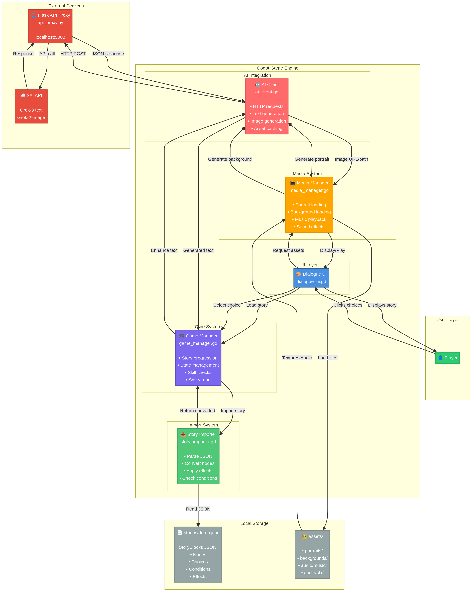

# StoryBlocks-Godot Architecture

## Overview

This document describes the high-level architecture of the StoryBlocks-Godot integration, showing how components interact to create an AI-powered narrative RPG.

## Architecture Diagram



## System Components

### 1. User Layer

**Player** 👤
- Interacts with the game through the UI
- Makes choices to progress the story
- Views character stats and inventory

### 2. Godot Game Engine

#### UI Layer

**Dialogue UI** (`scripts/ui/dialogue_ui.gd`) 🎨
- Displays story text with animated reveal
- Shows character portraits and backgrounds
- Renders choice buttons
- Updates stats panel
- Handles theme toggle (light/dark mode)

#### Core Systems

**Game Manager** (`scripts/core/game_manager.gd`) 🎮
- **Story Progression:** Navigates between story nodes
- **State Management:** Tracks stats, inventory, flags, relationships
- **Skill Checks:** Performs dice-based checks against difficulty
- **Save/Load:** Persists game state to disk
- **AI Coordination:** Decides when to enhance content with AI

#### Import System

**Story Importer** (`scripts/import/story_importer.gd`) 📥
- **Parse JSON:** Reads StoryBlocks story files
- **Convert Nodes:** Transforms StoryBlocks format to Godot format
- **Apply Effects:** Modifies game state (stats, inventory, flags)
- **Check Conditions:** Evaluates stat/inventory/flag requirements

#### AI Integration

**AI Client** (`scripts/ai/ai_client.gd`) 🤖
- **HTTP Requests:** Communicates with Flask proxy
- **Text Generation:** Requests AI-generated dialogue
- **Image Generation:** Requests AI-generated portraits/backgrounds
- **Asset Caching:** Downloads and saves generated assets locally

#### Media System

**Media Manager** (`scripts/media/media_manager.gd`) 🎬
- **Portrait Loading:** Loads character images (local or AI-generated)
- **Background Loading:** Loads location images (local or AI-generated)
- **Music Playback:** Plays background music with crossfade
- **Sound Effects:** Plays UI and ambient sounds

### 3. Local Storage

**stories/demo.json** 📄
- StoryBlocks JSON format containing:
  - **Nodes:** Story content and dialogue
  - **Choices:** Player decision points
  - **Conditions:** Requirements for choices
  - **Effects:** State modifications

**assets/** 🖼️
- **portraits/**: Character portrait images
- **backgrounds/**: Location background images
- **audio/music/**: Background music tracks (.ogg, .mp3, .wav)
- **audio/sfx/**: Sound effect files

### 4. External Services

**Flask API Proxy** (`api_proxy.py`) 🌐
- Runs on `localhost:5000`
- Handles CORS for browser/Godot requests
- Routes requests to appropriate AI providers
- Manages API keys securely

**xAI API** ☁️
- **Grok-3:** Text generation model
- **Grok-2-image:** Image generation model
- Provides AI-powered content creation

## Data Flow

### Story Loading Flow

```
1. Player launches game
2. DialogueUI requests story load from GameManager
3. GameManager calls StoryImporter
4. StoryImporter reads stories/demo.json
5. StoryImporter converts JSON to Godot format
6. GameManager initializes game state
7. GameManager navigates to start node
8. DialogueUI displays first scene
```

### Choice Selection Flow

```
1. Player clicks choice button
2. DialogueUI calls GameManager.select_choice()
3. GameManager checks choice condition (if any)
4. GameManager performs skill check (if required)
5. GameManager applies choice effects
6. GameManager navigates to next node
7. DialogueUI updates display
```

### AI Enhancement Flow

```
1. GameManager detects short/placeholder text
2. GameManager calls AIClient.generate_text()
3. AIClient sends HTTP POST to Flask proxy
4. Flask proxy forwards to xAI API
5. xAI generates content
6. Flask proxy returns JSON response
7. AIClient extracts text
8. GameManager updates node text
9. DialogueUI displays enhanced content
```

### Asset Generation Flow

```
1. MediaManager checks for portrait/background
2. If not found locally, requests AI generation
3. MediaManager calls AIClient.generate_image()
4. AIClient sends HTTP POST to Flask proxy
5. Flask proxy forwards to xAI API
6. xAI generates image
7. Flask proxy returns image URL
8. AIClient downloads image
9. AIClient saves to user://cache/
10. MediaManager loads texture
11. DialogueUI displays image
```

## Communication Patterns

### Synchronous Communication

- **UI → Core:** Direct function calls
- **Core → Import:** Direct function calls
- **Media → Assets:** File I/O operations

### Asynchronous Communication

- **Core → AI:** HTTP requests with await
- **Media → AI:** HTTP requests with await
- **AI → Flask:** HTTP POST/GET

### Event-Driven Communication

- **GameManager signals:**
  - `story_loaded` → DialogueUI
  - `node_changed` → DialogueUI
  - `state_changed` → DialogueUI

- **MediaManager signals:**
  - `portrait_loaded` → DialogueUI
  - `background_loaded` → DialogueUI
  - `music_changed` → (observers)

- **AIClient signals:**
  - `text_generated` → GameManager
  - `image_generated` → MediaManager
  - `generation_failed` → (error handlers)

## State Management

### Game State Structure

```gdscript
{
  "stats": {
    "health": 100,
    "courage": 50,
    "wisdom": 50
  },
  "inventory": ["map", "compass"],
  "flags": {
    "found_river": true,
    "met_sage": false
  },
  "variables": {
    "playerName": "Adventurer"
  },
  "relationships": {}
}
```

### State Persistence

- **Runtime:** In-memory dictionary in GameManager
- **Save:** JSON file in `user://save_0.json`
- **Load:** Restore from JSON file

## Extension Points

### Adding New Systems

1. **Create script** in appropriate directory
2. **Add autoload** in project.godot (if singleton)
3. **Connect signals** to existing systems
4. **Update UI** to display new features

### Adding New Story Formats

1. **Extend StoryImporter** with new parser
2. **Add conversion logic** for new node types
3. **Update GameManager** to handle new mechanics

### Adding New AI Providers

1. **Update AIClient** with new provider config
2. **Add API endpoint** to Flask proxy
3. **Configure credentials** in .env file

## Performance Considerations

### Optimization Strategies

- **Asset Caching:** Generated images cached in memory and disk
- **Lazy Loading:** Assets loaded on-demand, not at startup
- **Signal-Based Updates:** UI only updates when state changes
- **Async Operations:** AI requests don't block gameplay

### Resource Management

- **Memory:** ~100MB typical usage with 10 portraits
- **Disk:** Generated assets stored in user:// directory
- **Network:** AI requests only when needed (not every node)

## Security Considerations

### API Key Protection

- **Development:** Keys in .env file (gitignored)
- **Production:** Environment variables on server
- **Client:** Godot never exposes keys (Flask proxy handles)

### Content Validation

- **JSON Parsing:** Error handling for malformed files
- **Condition Evaluation:** Safe expression parsing
- **File Access:** Restricted to project and user:// directories

## Deployment Architecture

### Development Setup

```
Developer Machine
├── Godot Editor (editing)
├── Godot Game (testing)
└── Flask Proxy (localhost:5000)
    └── xAI API (cloud)
```

### Production Setup

```
Player Machine
└── Godot Game (exported)
    └── Flask Proxy (remote server)
        └── xAI API (cloud)
```

## Technology Stack

### Frontend (Godot)

- **Engine:** Godot 4.3
- **Language:** GDScript
- **Architecture:** Scene-based with singletons
- **Export:** HTML5, Windows, macOS, Linux, Android, iOS

### Backend (Flask)

- **Framework:** Flask (Python)
- **Libraries:** requests, flask-cors
- **Server:** Development server or gunicorn
- **Deployment:** Systemd service or Docker

### AI Services

- **Provider:** xAI (primary)
- **Models:** Grok-3 (text), Grok-2-image (images)
- **Alternatives:** OpenAI, Anthropic Claude (configured)

## Future Architecture Enhancements

### Planned Additions

1. **Entity System Integration**
   - Import NPCs, monsters, locations, items from StoryBlocks
   - Add entity database manager
   - Implement entity-based encounters

2. **Sprite System**
   - Isometric renderer for rooms
   - Character movement controller
   - Collision and navigation

3. **Multiplayer Support**
   - Shared story progression
   - Collaborative choices
   - Real-time synchronization

4. **Content Pipeline**
   - Automated asset generation
   - Batch processing of stories
   - Asset optimization

## References

- **Godot Documentation:** https://docs.godotengine.org/
- **StoryBlocks Repository:** https://github.com/lukeslp/campbell
- **xAI API Docs:** https://docs.x.ai/
- **Flask Documentation:** https://flask.palletsprojects.com/

---

**Last Updated:** 2025-11-21

**Maintainer:** StoryBlocks-Godot Contributors
